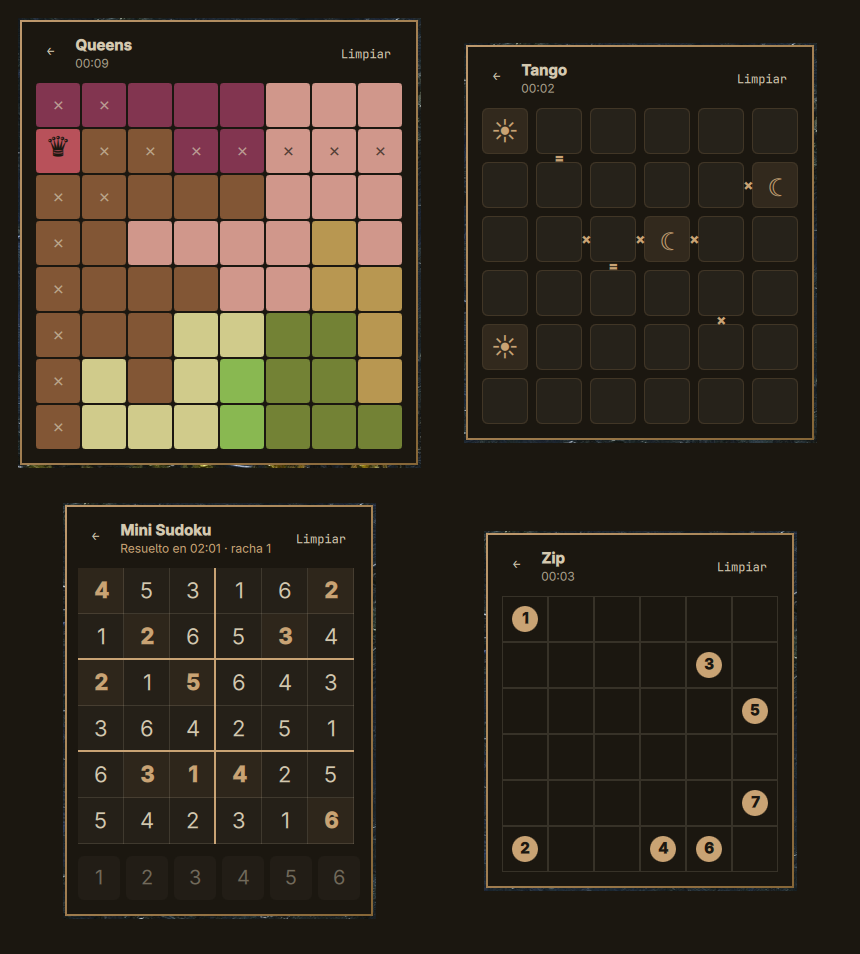
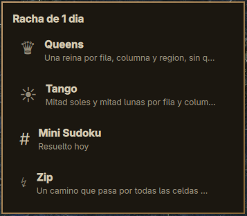
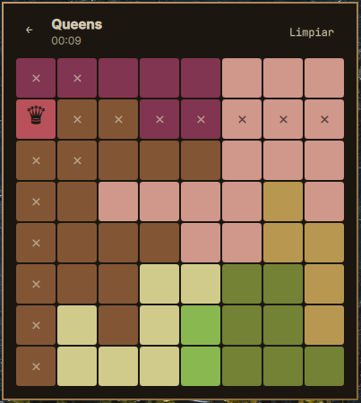
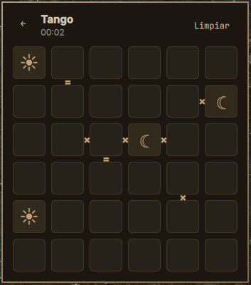
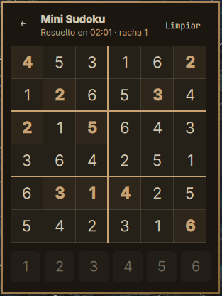
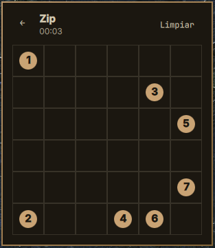

# Omarchy Puzzles

*[Read this in English](README.md)*

Cuatro puzzles diarios en la barra de [Omarchy](https://omarchy.org), al estilo
de los de LinkedIn: **Queens**, **Tango**, **Mini Sudoku** y **Zip**. Un clic
abre el menú con los juegos y su estado del día; elegís uno y lo jugás ahí
mismo.

Cada tablero se genera en tu equipo a partir de la fecha del día, con solución
única garantizada por un solver. Una racha global cuenta los días en que
resolviste al menos uno.

Sin red. Sin dependencias. Sin telemetría.



## Los juegos



### Queens ♛

Una reina por fila, por columna y por región de color, y que ninguna toque a
otra — tampoco en diagonal.

Poner una reina marca con una ✕ tenue cada celda que mata: su fila, su columna,
su región y sus ocho vecinas. Sacarla borra esas marcas y deja las que pusiste
vos.

El tamaño del tablero se configura: 7, 8 o 9.



### Tango ☀

Grilla de 6×6 que se llena con soles y lunas. Mitad de cada uno por fila y por
columna, nunca tres iguales seguidos, y los signos entre celdas vecinas mandan:
`=` obliga a que sean iguales, `×` a que sean distintas.

Las celdas que vienen puestas no se editan.



### Mini Sudoku #

Grilla de 6×6 con los dígitos del 1 al 6, sin repetir por fila, por columna ni
por caja de 2×3.

Elegís la celda y después el dígito en el teclado de abajo. El mismo dígito otra
vez lo borra.



### Zip ↯

Un camino que pasa por **todas** las celdas exactamente una vez, tocando los
números en orden ascendente. Se juega arrastrando: el camino se extiende a la
celda vecina que toca el puntero, y volver sobre la anteúltima lo acorta.

Empezar desde el número 1 reinicia el camino.



## Instalación

```bash
omarchy plugin add https://github.com/CristoSolar/omarchy-puzzles.git
```

O desde una copia local:

```bash
git clone https://github.com/CristoSolar/omarchy-puzzles.git
cd omarchy-puzzles && ./install.sh
```

Después agregá el widget a la barra desde el menú de Omarchy (Setup → Plugins),
o a mano en `~/.config/omarchy/shell.json`, dentro de `bar.layout`:

```json
{ "id": "io.github.cristosolar.puzzles" }
```

## Desinstalar

```bash
omarchy plugin remove io.github.cristosolar.puzzles
```

Después sacá su entrada de `bar.layout` en `~/.config/omarchy/shell.json`.

Tu racha y tus mejores tiempos quedan en `~/.local/state/omarchy-puzzles/`;
borrá esa carpeta si también los querés sacar. El plugin no escribe en ningún
otro lado.

## Opciones

| Opción | Valores | Por defecto | Qué hace |
|--------|---------|-------------|----------|
| `size` | 7, 8, 9 | 8 | Lado del tablero de Queens y cantidad de regiones |

## El widget de la barra

Muestra una corona con tu racha global, atenuada mientras quede algún juego sin
resolver hoy y encendida cuando los cuatro están hechos. El tooltip dice cuántos
faltan.


## Tus datos

Todo vive en `~/.local/state/omarchy-puzzles/state.json`:

```json
{
  "version": 2,
  "streak": 3,
  "lastSolvedDay": "2026-09-23",
  "games": {
    "queens": {
      "lastSolved": "2026-09-23",
      "lastElapsedMs": 61000,
      "best": { "8": 55000 },
      "inProgress": null
    }
  }
}
```

La racha sube la primera vez que resolvés **cualquiera** de los cuatro en un
día, y se reinicia tras un día sin jugar. Cada juego guarda su mejor tiempo por
tamaño de tablero y su partida a medias, que se guarda al volver al menú o
cerrar el panel y se descarta al cambiar el día.

Borrar ese archivo te deja de cero. Uno corrupto también: el plugin vuelve a los
valores por defecto en vez de romperse.

## Desarrollo

La lógica de los juegos es JavaScript plano en `lib/` y `games/*/logic.js`, sin
QML ni acceso a disco, así que corre con Node sin levantar el shell:

```bash
node --test
```

Cada juego es una carpeta más una línea en `lib/registry.js` y un import en
`GameRegistry.qml`. El contrato que implementa su `logic.js`, y los detalles de
cada generador, están documentados en el [README en inglés](README.md#development).

## Licencia

MIT
