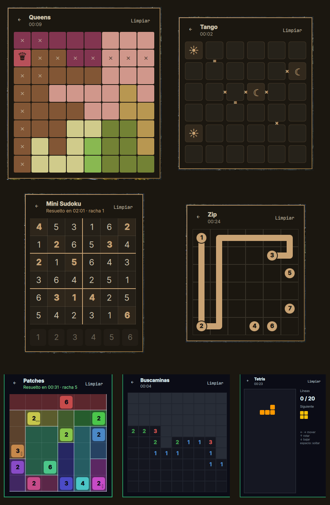
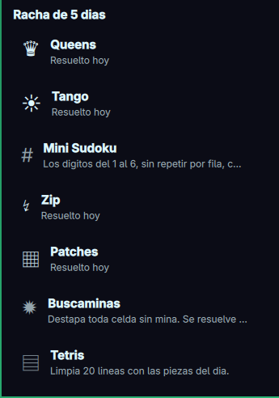
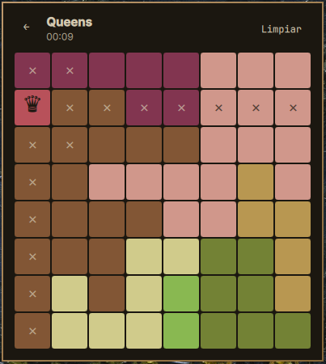
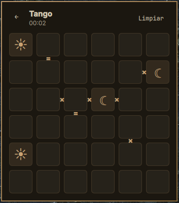
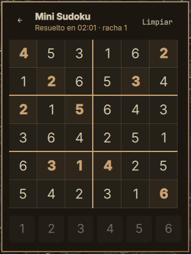
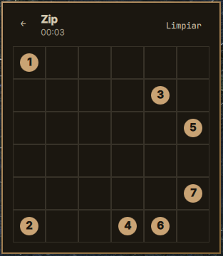
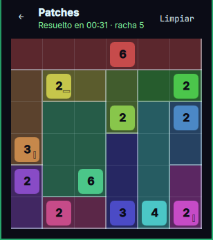
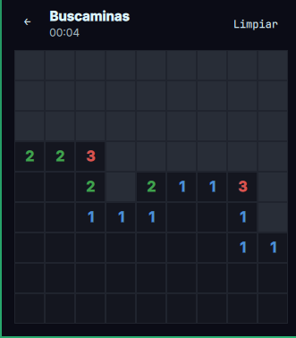
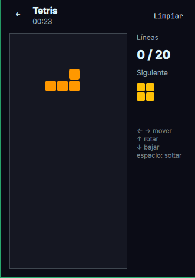
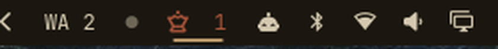

# Omarchy Puzzles

*[Leer en español](README.es.md)*

Seven daily puzzles in your [Omarchy](https://omarchy.org) bar, in the spirit of
the LinkedIn games: **Queens**, **Tango**, **Mini Sudoku**, **Zip**, **Patches**, **Minesweeper** and **Tetris**. One click
opens a menu with the games and today's status; pick one and play it right
there.

Every board is generated on your machine from the day's date, with a unique
solution guaranteed by a solver (Minesweeper: solvable without guessing; Tetris: the same piece sequence for everyone that day). A global streak counts the days you solved at
least one.

No network. No dependencies. No telemetry.



## The games



### Queens ♛

One queen per row, per column and per colored region, and no two queens
touching — not even diagonally.

Placing a queen marks every cell it kills with a faint ✕: its row, its column,
its region and its eight neighbours. Removing the queen clears those marks and
leaves the ones you made yourself.

Board size is configurable: 7, 8 or 9.



### Tango ☀

A 6×6 grid filled with suns and moons. Half of each per row and per column,
never three of the same in a row, and the signs between neighbouring cells
rule: `=` forces them equal, `×` forces them different.

The cells that come filled in can't be edited.



### Mini Sudoku #

A 6×6 grid with the digits 1 to 6, no repeats per row, per column or per 2×3
box.

Pick a cell, then press a digit on the pad below. Pressing the same digit again
clears it.



### Zip ↯

One path visiting **every** cell exactly once, touching the numbers in
ascending order. Drag to draw: the path extends to the neighbouring cell your
pointer touches, and going back over the previous one shortens it.

Starting from the number 1 resets the path.



### Patches ▦

Cover the 6×6 grid with rectangles that don't overlap. Each rectangle holds
exactly one clue: its area is the clue's number and, if the clue shows a shape,
it follows it — □ square, ▭ wider than tall, ▯ taller than wide.

Drag from corner to corner to draw a rectangle; it goes to the one clue inside
it. Drawing again for the same clue moves it, and anything it covers is
erased. Click a rectangle to remove it.



### Minesweeper ✹

9×9 with 10 mines. The board opens with an area already revealed, and from
there it can be solved by logic alone — no guessing.

Left click reveals, right click flags. Hitting a mine shows them all for a
second and resets the board; the clock keeps running.



### Tetris ▤

Clear 20 lines with the day's pieces. ← → move, ↑ rotates, ↓ soft drops,
space hard drops. Topping out restarts the same sequence; the clock keeps
running. A run isn't saved if you close the panel.



## Install

```bash
omarchy plugin add https://github.com/CristoSolar/omarchy-puzzles.git
```

Or from a local clone:

```bash
git clone https://github.com/CristoSolar/omarchy-puzzles.git
cd omarchy-puzzles && ./install.sh
```

Then add the widget to your bar from the Omarchy menu (Setup → Plugins), or by
hand in `~/.config/omarchy/shell.json`, inside `bar.layout`:

```json
{ "id": "io.github.cristosolar.puzzles" }
```

## Uninstall

```bash
omarchy plugin remove io.github.cristosolar.puzzles
```

Then drop its entry from `bar.layout` in `~/.config/omarchy/shell.json`.

Your streak and best times stay in `~/.local/state/omarchy-puzzles/`; delete that
folder to remove them too. The plugin writes nothing anywhere else.

## Options

| Option | Values | Default | What it does |
|--------|--------|---------|--------------|
| `size` | 7, 8, 9 | 8 | Queens board size and number of regions |

## The bar widget

Shows a crown with your global streak, dimmed while any game is still unsolved
today and lit once all seven are done. The tooltip says how many are left.



## Your data

Everything lives in `~/.local/state/omarchy-puzzles/state.json`:

```json
{
  "version": 2,
  "streak": 3,
  "lastSolvedDay": "2026-09-23",
  "games": {
    "queens": {
      "lastSolved": "2026-09-23",
      "lastElapsedMs": 61000,
      "best": { "8": 55000 },
      "inProgress": null
    }
  }
}
```

The streak goes up the first time you solve **any** of the seven on a given day,
and resets after a day without playing. Each game keeps its own best time per
board size, and its half-finished game, which is saved when you go back to the
menu or close the panel and discarded when the day rolls over.

Deleting that file starts you from scratch. So does a corrupted one — the plugin
falls back to defaults instead of breaking.

## Development

The game logic is plain JavaScript in `lib/` and `games/*/logic.js`, with no QML
and no disk access, so it runs under Node without starting the shell:

```bash
node --test
```

```
lib/rng.js              the day's seed and the PRNG
lib/state.js            global streak, per-game state, migration
lib/registry.js         which games exist
games/<id>/logic.js     rules, generator and solver for one game
games/<id>/Board.qml    that game's board and its own input model
Panel.qml               the shell: menu ↔ board
Menu.qml                the game list
```

### Adding a game

A game is a folder plus one line in `lib/registry.js` and one import in
`GameRegistry.qml`. Its `logic.js` implements:

```js
meta = { id, name, icon, sizes, defaultSize, blurb }
generate(rand, size) -> board        // deterministic; the seeded PRNG is passed in
conflicts(board, cells) -> [indices] // what's wrong right now, partial grids included
isSolved(board, cells) -> boolean
emptyCells(board) -> cells           // the starting position
solvedCells(board) -> cells          // the finished board
maxCellValue(board) -> number        // the highest a cell can hold
```

`board` and `cells` are opaque to the shell: only that game's `logic.js` and its
`Board.qml` interpret them. Input models differ on purpose — Queens cycles a
cell, Tango toggles, Sudoku takes a digit, Zip is drawn by dragging, Patches is drawn corner to corner, Minesweeper uses both buttons, Tetris takes the keyboard — so each
game ships its own board.

No file in `lib/` or `games/*/logic.js` imports another: QML's JS engine only
accepts `.import`, which Node can't parse, so anything shared is passed as an
argument.

A board that wants the keyboard defines `keyMove(dx, dy)` and `keyAction()`;
`Panel.qml` forwards arrows (and hjkl) and space/Enter to them when present.

### The generators

Each one produces a puzzle with a **single** solution, verified by a solver with
early cutoff:

- **Queens** grows colored regions from a valid placement, then refines: it
  finds a spare solution and kills it by moving one of its cells to a
  neighbouring region. Purely random growth yields a unique solution less than
  once in 300 tries on an 8×8, so retrying doesn't get there.
- **Tango** starts from a full valid grid with every constraint, then prunes
  givens and constraints interleaved, with a floor on each. Without at least one
  given a Tango board always has two solutions: swapping every sun for a moon
  preserves the counts, the no-three-in-a-row rule and every constraint.
- **Mini Sudoku** digs holes out of a full grid, reverting any hole that leaves
  more than one solution.
- **Zip** builds a random Hamiltonian path, numbers all of it, then drops
  numbers while the path stays unique. Counting Hamiltonian paths explodes
  without pruning, so the counter drops any branch that splits the unvisited
  cells into islands, and carries a node budget as a backstop.
- **Patches** partitions the grid into random rectangles of area 2–8, puts a
  clue in each and reveals half the shapes; while the solver finds a second
  solution it reveals hidden shapes one at a time, and retries if that's not
  enough.
- **Minesweeper** places mines at random, starts from a cell with no mines
  around it, and keeps the board only if a no-guessing solver (single-number
  and subset rules) clears it.
- **Tetris** shuffles 86 bags of the seven pieces; the board just plays that
  queue.

Worst case measured on a 6th-gen laptop: 196 ms (Queens 9×9), 3 ms (Tango),
3 ms (Sudoku), 149 ms (Zip), 3 ms (Patches), 1 ms (Minesweeper), 1 ms (Tetris).

## License

MIT
